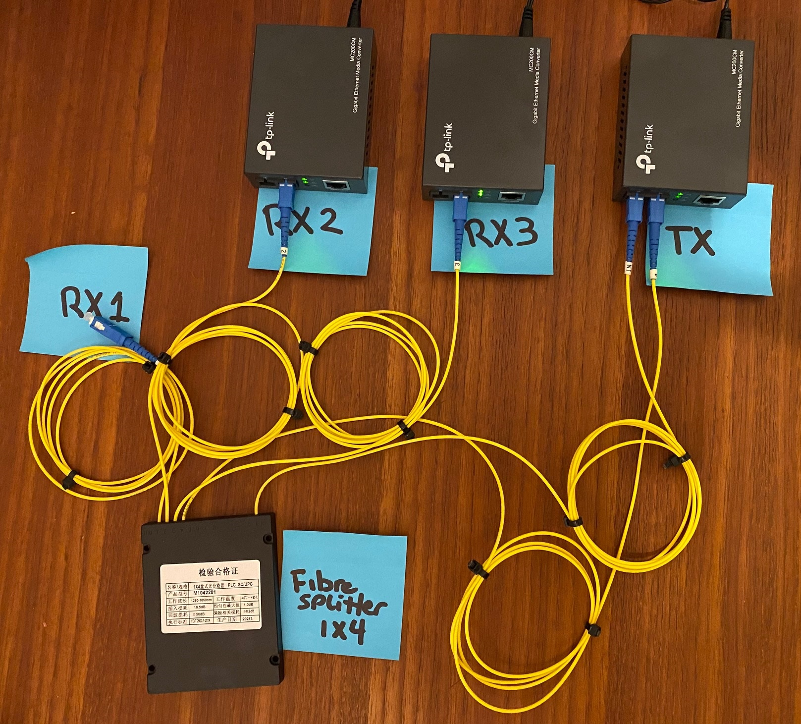
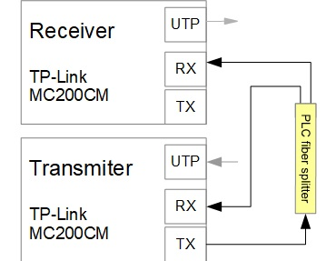
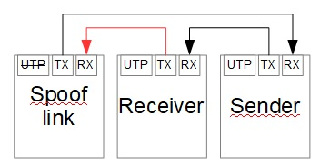
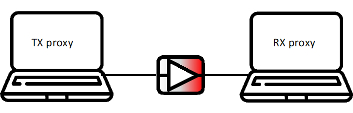
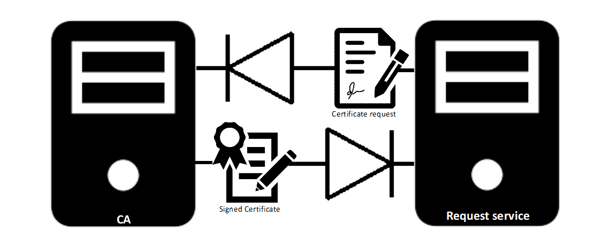

# Example data-diode hardware setups

## Physical data-diode setup

In this setup we used 3 TP-Link MC200CM Gigabit mediaconverters and a PLC Fibre Splitter 1X4 SC/UPC-interface.

The TX-mediaconverter TX-port is connected with the IN-fiber from the splitter and the 4th splitted fiber to the RX-port to simulate a link.<br>
The RX3 mediaconverter RX-port is connected with the 3th splitter fiber. <br>
The RX2 mediaconverter RX-port is connected with the 2th splitter fiber. <br>
The 1th fiber is not connected but could also be connected to a  mediaconverter but i only had three converters available.

This way we created a one to many datadiode setup but this could also be done with a 1x2 PLC splitter with only 2 mediaconverters. <br> See 2nd simplyfied image.

 

<b>Update:</b> We noticed network errors on the TX proxy. The assumption is a faulty fibersplitter or the wrong type of cable. <br>
TCPDUMP output:

```
20:10:26.441796 MPCP, Opcode Pause, length 46
20:10:26.442321 MPCP, Opcode Pause, length 46
20:10:26.442845 MPCP, Opcode Pause, length 46
...... and many more..... 
```

Testing with standard cables prevents the MPCP errors. Note: this not a true data-diode due to the loop in the system. 



When we created a direct loop on TX-RX using only one mediaconverter with a standard cable we only received the MPCP message 4 times when sending 5Gb on full speed from the Transmitter proxy. Educated guess is a faulty splitter. Waiting for a new splitter to arrive to check if its a broken fiber or the wrong type of hardware/cable.

# Examples with proxies

## Basic setup



## 2 way uni-directional setup

To be able to send and receive data via separate interfaces causing a protocol break for most network attacks. This setup also provides control over the received and send data.
In this example we send an OpenSSL certificate request trough the data-diode to be signed by the CA. After signing the CA sends the signed certificate trough the second data-diode back to the sender.



## One proxy to many destinations

Since we are using one way communication it's also possible to use multiple data-diodes and destinations using a switch.


## NTP distribution to multiple stand alone networks

This example shows an example to distribute NTP to multiple networks. Note that this configuration does not support NTPv4 foley's.


## Guaranteed one way span port to IDS

In this example we prevent the IDS to connect back to the switch via the SPAN port.


## Virtual data-diode

For testing data-diode applications on one machine its possible to create a Ubuntu VM with 2 interfaces connected to separate local networks.
Using the application daemonlogger you can forward all packets from the first interface to the second.


# Helpful links

## Wavestone-cdt DIY Dyode

DIY Datadiode using 3 copper to fiber converters and a light version using 2 PI zero's and an optocoupler.

Software includes
* Modbus data transfer
* File transfer (DYODE full only)
* Screen sharing (DYODE full only)

https://github.com/wavestone-cdt/dyode 

## EBUJOLD data-diode

DIY data-diode like the Wavestone solution. Good explanation about the configuration of the media converters in the wiki under hardware.

https://github.com/EBUJOLD/data-diode 

## Klockcykel Godiode

DIY Data-diode using 2 modded TP-link copper to fiber converters. Costs +- €65,-

Software includes Go code and Docker. Transfer speed up to 750Mbit.

Please note: Soldering requires a microscope due to the size of the pcb 

https://github.com/klockcykel/godiode 

### Mitcdh 

Example how to configure a Cisco switch as an data-diode

https://github.com/mitcdh/diode-switch-config 


## Dutch Open Source Datadiode project

Dutch project to build an open source datadiode

https://securitydelta.nl/nl/projects/project/99-open-source-data-diode 

### Georgesrusu

Webportal in combination with BlindFTP (not tested). Read the (good) report first.

https://github.com/georgesrusu/managementSecuDataDiode/blob/master/Rapport/rapport.pdf 

### Cylab-be

Good resource for documentation and webbased solution.

https://gitlab.cylab.be/cylab/data-diode

### MeghaSharma31

Nice report on data-diodes using the ATM protocol.

https://github.com/MeghaSharma31

### Cea-sec Hairgap

Hairgap is a set of tools to transfer data over a unidirectional network link. (Aplha)

https://github.com/cea-sec/hairgap

### Bhanq

The goal of this project was to implement a (virtual) Data Diode according to some CyberSecurity frameworks NIST SP 800-30 : Risk analysis report and Common criteria.

https://github.com/BHanq/DataDiode
