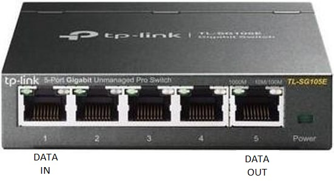
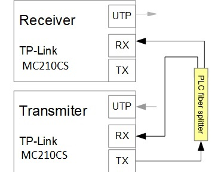
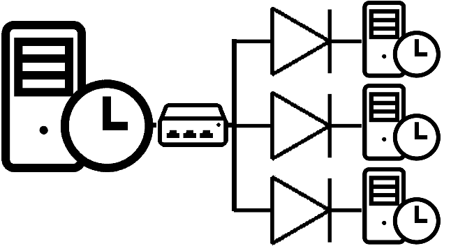
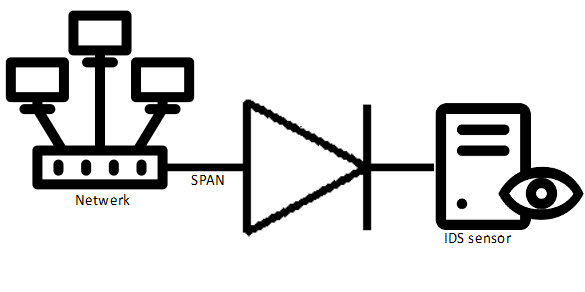
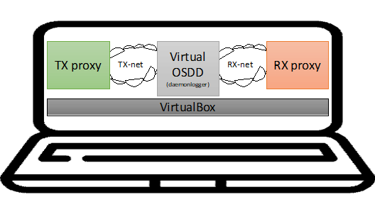

# Example data-diode hardware setups

## Functional data diode for DEV & Training
This simple and cheap setup is the easiest way to give data diode trainings/workshops and develop dataflows. Since this is not a real data diode it should not be used in production. This [€25 euro functional data-diode demonstrator](https://github.com/Vrolijk/OSDD/blob/main/examples/25_euro_data-diode_demonstator.md) 
can be orderd at most shops.
 


## More secure basic setup

In this setup we used 2 TP-Link MC210CS single mode Gigabit mediaconverters, one single mode 50/50 splitter and a fiber filter for additional security.


## Using only one fiber between the TX and RX
On Gitub [Klockcykel](https://github.com/klockcykel/godiode/tree/main/hardware) modified the TP-Link mediaconverter to be used with only one fibre. This is a great DIY hardware data diode solution but be aware that modifing hardware could be dangerous.

 

## Physical data diode setup

In this setup we used 3 TP-Link ~~MC200CM multi mode~~ MC210CS single mode Gigabit mediaconverters and a PLC Fibre Splitter 1X4 SC/UPC-interface. 1 for sending, 3 for receiving. This setup can also be done with just 2 or 4 receivers. <br>
<i>Please note that the splitter is single mode, not multi mode! Example of a 2-way splitter on [Amazon](https://www.amazon.com/Optical-Splitter-Singlemode-Pigtail-Distribution/dp/B0B4SHKJBS/ref=sr_1_3?th=1) </i>

The TX-mediaconverter TX-port is connected with the IN-fiber from the splitter and the 4th splitted fiber to the RX-port to simulate a link.<br>
The RX3 mediaconverter RX-port is connected with the 3th splitter fiber. <br>
The RX2 mediaconverter RX-port is connected with the 2th splitter fiber. <br>
The 1th fiber is not connected but could also be connected to a  mediaconverter but i only had three converters available.

This way we created a one to many datadiode setup but this could also be done with a 1x2 PLC splitter with only 2 mediaconverters. <br> See 2nd simplyfied image.

 

# Hardware setups in combination with proxies

## Basic setup

This is the most common setup wtih a sender and receiver and the data diode in the middle.


## 2 way uni-directional setup

To be able to send and receive data via separate interfaces causing a protocol break for most network attacks. This setup also provides control over the received and send data.
In this example we send an OpenSSL certificate request trough the data-diode to be signed by the CA. After signing the CA sends the signed certificate trough the second data-diode back to the sender.


## One proxy to many destinations

Since we are using one way communication it's also possible to use multiple data-diodes and destinations using a switch.


## NTP distribution to multiple stand alone networks

This example shows an example to distribute NTP to multiple networks. Note that this configuration does not support NTPv4 foley's.



## Guaranteed one way span port to IDS

In this example we prevent the IDS to connect back to the switch via the SPAN port.



## Virtual data-diode

For testing data-diode applications on one machine its possible to create a Ubuntu VM with 2 interfaces connected to separate local networks.
Using the application daemonlogger you can forward all packets from the first interface to the second.




# Lessons learned

Understand the difference between multi mode and single mode fiber. 
We noticed network errors on the TX proxy. The cause was a single mode fiber splitter in combination with multi mode mediaconverters.
TCPDUMP output:

```
20:10:26.441796 MPCP, Opcode Pause, length 46
20:10:26.442321 MPCP, Opcode Pause, length 46
20:10:26.442845 MPCP, Opcode Pause, length 46
...... and many more..... 
```

So depending on your cables you can use the MC200CM multi mode or MC210CS single mode media converters. 
