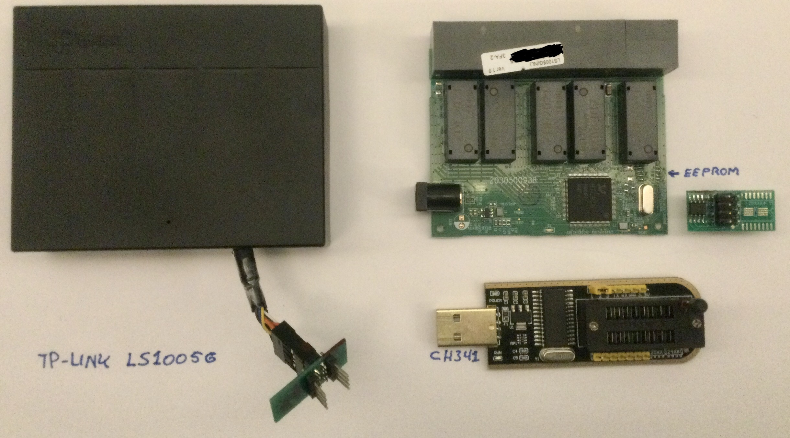

# Turning a €10 Switch into a Data Diode: Affordable Cybersecurity for OT Environments

In the world of cybersecurity, **data diodes** are often seen as the bank vaults of secure data transfer—impenetrable, expensive, and complex. But what if you could achieve robust, unidirectional data flow for just €10 using a common network switch? By tweaking the EEPROM registers of an unmanaged switch with an RTL8367S chip, we can create a low-cost data diode perfect for operational technology (OT) environments and microsegmentation. Sometimes, all you need is a good lock, not a vault.

### The Idea: A €10 Data Diode
The RTL8367S, a chip found in many affordable unmanaged switches (and even cheaper than some managed ones), handles Ethernet switching with remarkable flexibility. By accessing and modifying the switch’s EEPROM registers, you can reprogram its behavior to enforce **unidirectional data flow**—the hallmark of a data diode. This means data can move from a source (e.g., an OT sensor) to a destination (e.g., a monitoring system) without any possibility of reverse communication, all for the price of a coffee.

Here’s how it works:
1. **Identify the Switch**: Choose an unmanaged switch with the RTL8367S chip, often found in budget models costing around €10.
2. **Access the EEPROM**: Use tools like an I2C programmer or JTAG interface to read and modify the switch’s EEPROM.
3. **Reconfigure Registers**: Adjust the switch’s port settings to disable reverse traffic, effectively creating a one-way data path. For example, you can set specific ports to forward packets in one direction while dropping all incoming traffic from the destination.
4. **Test and Deploy**: Verify the unidirectional flow with packet capture tools and deploy the switch in your OT network.

### Why This Matters for OT and Microsegmentation
In OT environments—like manufacturing plants, energy grids, or water treatment facilities—security is critical, but budgets are often tight. Traditional data diodes, costing thousands of euros, are overkill for many use cases. A €10 data diode offers:
- **Microsegmentation**: Isolate OT devices to prevent lateral movement by attackers. For instance, sensors can send data to a central system without exposing themselves to external commands.
- **Affordable Security**: Protect critical infrastructure without breaking the bank, making cybersecurity accessible for smaller organizations.
- **Simplicity**: No need for complex configurations or proprietary hardware—just a switch, some register tweaks, and a clear use case.

### Redefining the Data Diode Mindset
The biggest barrier to adopting data diodes is the misconception that they must be fortress-like solutions, reserved for high-security environments like defense or finance. In reality, many OT use cases don’t need a bank vault—they need a **reliable lock**. A €10 data diode provides just that: a simple, effective way to ensure data flows one way, reducing attack surfaces without unnecessary complexity.

### Challenges and Considerations
While this approach is powerful, it’s not without caveats:
- **Technical Expertise**: Modifying EEPROM registers requires some hardware and networking knowledge, though open-source tools and community guides can help.
- **Limited Features**: Unlike commercial data diodes, this solution prioritizes simplicity over advanced features like protocol conversion or high throughput.
- **Validation**: For critical deployments, rigorous testing is essential to ensure no reverse traffic leaks through misconfigured settings.
- **Undocumented features**: Undocumented and vendor specific features are a major security risk in this setup. 

### A Game-Changer for OT Security
This €10 data diode concept, inspired by projects like the Open Source Data Diode (OSDD) initiative, shows how creativity and open-source principles can democratize cybersecurity. By repurposing commodity hardware, we can protect OT environments, enable microsegmentation, and challenge the notion that security must be expensive.

What do you think—could this approach work in your OT environment? Have you explored other low-cost cybersecurity hacks? Let’s start a conversation about making security accessible for all!

# The experiment
For this we bought a €9,99 TP-Link LS1005G 5 port switch, removed the eeprom and placed it on an external print and made a connector on the switch. Via the CH341 USB we connected the eeprom to a PC to read the firmware/register.
 <br>

**Full register including blanks (FF)** <br>
56 80 16 1D 69 0A 01 1D  E0 03 1B 20 9A 80 1C 20 <br> 
11 89 1B 20 A3 80 1C 20  33 92 1B 20 AC 80 1C 20  <br>
44 A4 1B 20 9F 80 1C 20  20 6B 1B 20 A8 80 1C 20  <br>
22 6B 1B 20 B1 80 1C 20  23 6B 01 1D 1F 00 18 00  <br>
00 00 38 00 00 00 58 00  00 00 78 00 00 00 98 00  <br>
00 00 41 1D 00 00 FF FF  FF FF FF FF FF FF FF FF  <br>
FF FF FF FF FF FF FF FF  FF FF FF FF FF FF FF FF  <br>
FF FF FF FF FF FF FF FF  FF FF FF FF FF FF FF FF  <br>
FF FF FF FF FF FF FF FF  FF FF FF FF FF FF FF FF  <br>
FF FF FF FF FF FF FF FF  FF FF FF FF FF FF FF FF  <br>
FF FF FF FF FF FF FF FF  FF FF FF FF FF FF FF FF  <br>
FF FF FF FF FF FF FF FF  FF FF FF FF FF FF FF FF  <br>
FF FF FF FF FF FF FF FF  FF FF FF FF FF FF FF FF  <br>
FF FF FF FF FF FF FF FF  FF FF FF FF FF FF FF FF  <br>
FF FF FF FF FF FF FF FF  FF FF FF FF FF FF FF FF  <br>
FF FF FF FF FF FF FF FF  FF FF FF FF FF FF FF FF <br>
 <br>
**Register breakdown:** <br>
56 80                    *Read eeprom untill position 0x00000056 (see first FF), change to 13 C2 00 00 to brick the switch... * <br>
16 1D 69 0A 01 1D E0 03  *Unknown* <br>
 <br>
1B 20 9A 80 1C 20 11 89  *Pattern 1B 20 ?? 80 1C 20 ?? ?? (6 times)*  <br>
1B 20 A3 80 1C 20 33 92  <br>
1B 20 AC 80 1C 20 44 A4  <br>
1B 20 9F 80 1C 20 20 6B  <br>
1B 20 A8 80 1C 20 22 6B  <br>
1B 20 B1 80 1C 20 23 6B  <br>
 <br>
01 1D 1F 00 *Unknown* <br>
18 00 00 00 *Pattern 18, 38, 58, 78, 98* <br>
38 00 00 00  <br>
58 00 00 00  <br>
78 00 00 00  <br>
98 00 00 00  <br>
41 1D 00 00 FF FF FF FF <br>
 <br>

## how to read the vaules: (please note that this is my intrepertation trying to understand.. )

The register works in pairs. So the first pair [56 80 16 1D] set how far the register should be read. <br>
You can read the pair as an instruction to SET value [56 80] TO [16 1D] 

You can translate [56 80] to hex '0x5680'.  Decode the Value `0x5680` 

Hex `0x5680` in binary is:

```
0x5680 = 0101 0110 1000 0000 (binary)
          |||| |||| |||| ||||
          |||| |||| |||| |||└─ Bit 0
          |||| |||| |||| ||└── Bit 1
          |||| |||| |||| |└─── Bit 2
          |||| |||| |||| └──── Bit 3
          |||| |||| |||└────── Bit 4
          |||| |||| ||└─────── Bit 5
          |||| |||| |└──────── Bit 6
          |||| |||| └───────── Bit 7
          |||| |||└─────────── Bit 8
          |||| ||└──────────── Bit 9
          |||| |└───────────── Bit 10
          |||| └────────────── Bit 11
          |||└─────────────── Bit 12
          ||└──────────────── Bit 13
          |└───────────────── Bit 14
          └────────────────── Bit 15

```

So:

```
Bit 15 = 0
Bit 14 = 1
Bit 13 = 0
Bit 12 = 1
Bit 11 = 0
Bit 10 = 1
Bit 9  = 1
Bit 8  = 0
Bit 7  = 1
Bit 6  = 0
Bit 5  = 0
Bit 4  = 0
Bit 3  = 0
Bit 2  = 0
Bit 1  = 0
Bit 0  = 0
```


Good resource: https://github.com/tomazas/RTL8XXX-Switch. Added port mirroring to the TP-Link SG105 and SG108 including firmware samples. <br>
RTL8367S datasheet https://www.framboise314.fr/wp-content/uploads/2021/06/RTL8367S-CG_Datasheet.pdf <br>
RTL8367 programming guide https://cdn.jsdelivr.net/gh/libc0607/Realtek_switch_hacking@files/Realtek_Unmanaged_Switch_ProgrammingGuide.pdf <br>
Realtek_Unmanaged_Switch_API_driver https://github.com/shiroichiheisen/Realtek-Unmanaged-Switch-Arduino-Library/blob/main/programming%20guide/Realtek_Unmanaged_Switch_ReleaseNote.pdf <br>
Realtek Unmanaged switch API document https://github.com/shiroichiheisen/Realtek-Unmanaged-Switch-Arduino-Library/blob/main/programming%20guide/Realtek_Unmanaged_Switch_API_Document.pdf <br>


#Cybersecurity #OTSecurity #DataDiode #Microsegmentation #Networking #Innovation
