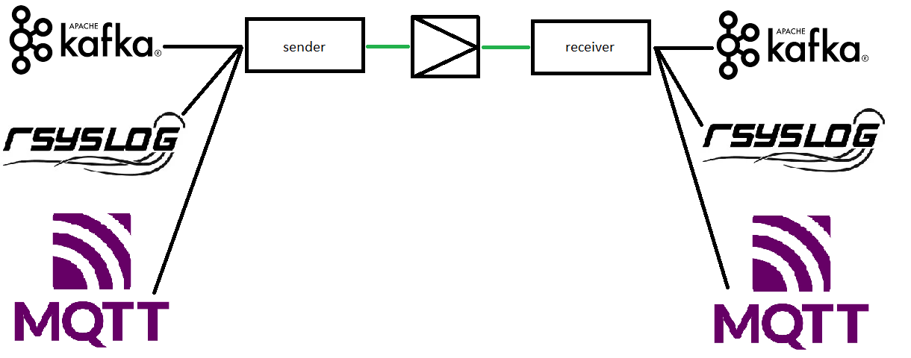

Working with UDPCast to transfer files made me wonder is there is an other application to create a one way tunnel that has the Forward Error Control (FEC) functionality combined with rate limiting. If there is no such application this could be an idea for a hackathon or a development team.

In my opinion the software should contain a sender and receiver that is able to receive data from a variation of applications. The goal is to create a permanent unidirectional tunnel between 2 (or more) computers. Using this tool it should be able to send the information via a data-diode. An other use-case is limiting network bandwidth by only sending the data of using a unidirectional radio link.. 

<b>Sender</b>
- should run constantly waiting for input from an application like a NETCAT tunnel [^1]
- should use UDP 
- should support Linux
- should be able to configure the transfer speed
- should send a keep alive every X receiver
- should add a sequence number to each packet
- could log a manifest on the senders machine
- could send the manifest every X to the receiver
- should be able to send to an IP, broadcast address or multicast destination on a specific interface
- should be able to add Forward Error Control (FEC) like UDPcast [^2]
- could be able to cache packets with a configurable disklocation and size
- could be able to add encryption using a defined password of public/private key
- should send every message/file/object as a separate session (to prevent the tunnel to terminate when one session fails)
- should be able to run as an application or a service 
- could be able to run a speed optimization to determine optimal speed and settings
- could prevent packet loss as described in ref [^3]
- should contain a debug mode

<b>Receiver</b>
- should run constantly waiting for input from a sender like a NETCAT tunnel [^1]
- should listen for a keep alive every X from the sender
- should monitor the packet sequence number and report on missing packets and report on missing packets
- could be able to receive a manifest and report on missing items
- could be able to log and report on missing sequencenumbers 
- could be able to add encryption using a defined password of public/private key
- should be able to run as an application or a service 
- could be able to run a speed optimization to determine optimal speed and settings and advice optimal settings
- could prevent packet loss as described in ref [^3]
- should contain a debug mode

[^1]:  https://www.devkb.org/linux/115-TCP-tunnel-port-forwarding-using-Netcat 
[^2]:  https://github.com/elisescu/udpcast/blob/master/fec.c
[^3]: https://github.com/Vrolijk/OSDD/blob/main/packetloss_explained.md
