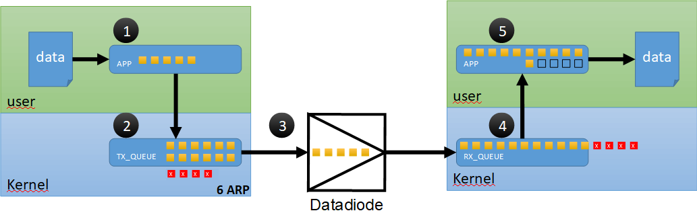

# Packet loss (almost) explained

:exclamation: *I like telling UDP jokes because I **do** care if you don't get them.*

One of the main issues when using data-diodes is not being able to check if the UDP packets you send arrived at the receiving proxy. During testing using large files we found out that one of the main issues is that the receiving application is not able to read the UDP packets quick enough from the rx_queue.
In this overview we try to explain this. 

*Please add an issue for this article if you can help because we still haven't found a final solution for this problem.*



In this overview we use 5 steps to explain the issue:

1. Sender application sends/receive the data
2. The application sends the data to the TX_QUEUE in kernel space
3. The UDP packets are send over the cable trough the data-diode to the receiver
4. The receiver receives the UDP packets and places them in the RX_QUEUE
5. The receiver application **reads** the UDP packets from the RX_QUEUE, processes them and writes the packets to the file

We found out that most of the packet loss happens on the receiving machine when the application is not able to read the RX_QUEUE fast enough. When the RX_QUEUE is full the kernel drops the packets and data is lost.

## Possible solutions

1. Send the data slower from the sender. The applications UDPcast or PV (pipe viewer) are able to send the data on a lower speed.
2. Enlarge the RX_QUEUE using sysctl. This only helps for small bursts, when sending multiple Gb's this has no use.
3. Use FEC (Forward Error Control). The application UDPcast has the option to add FEC.
4. Faster processing at the receiving application. Try to reduce the CPU load of the receiving application and/or limit other applications using the CPU
5. Faster writing to disk. Use SSD or memdisk to write the data.

## Monitoring packet loss

Monitor UDP queues and packets dropped. We are still looking into the best way to monitor the queues and this can be done on several ways.<br>
Monitor both the sender and receiver. 

```cat /proc/net/udp```

or use netstat

```
# sender 
sudo netstat -c -udp -an | grep "9001"```

# receiver
sudo netstat -c -udp -an | grep ".255:9000"```

or use ss

```watch -n 1 "ss -u -a -p -t '( sport = :9000 )'"```

or use traffic control (tc). 

```tc -s qdisc show dev eth0```

Bottom line, we noticed that the Recv-Q fills and the UDP-receiver application stops/crashed. 
Recv-Q is the count of bytes not copied by the user program connected to this socket.

Except for increasing the sysctl net.core.rmem_max we are still looking for a solution how to prevent the Recv-Q dropping packets. Please comment if you can help.

```sudo sysctl -w net.core.rmem_max=32777216```

Monitoring the softnet_stat we saw no increase of queues.

```cat /proc/net/softnet_stat```

### To do 

Good story about tuning TCP. Perhaps lowering the garbage collection could help to reduce packet loss on the receiving side.

https://blog.cloudflare.com/the-story-of-one-latency-spike/ 


**Helpful links**

https://arthurchiao.github.io/blog/monitoring-network-stack/ 

More details about UDP tuning: <br>
https://gilbertasm.github.io/2018/09/13/tunning-udp-buffers.html <br>
https://blog.packagecloud.io/monitoring-tuning-linux-networking-stack-sending-data/#monitoring-udp-protocol-layer-statistics
